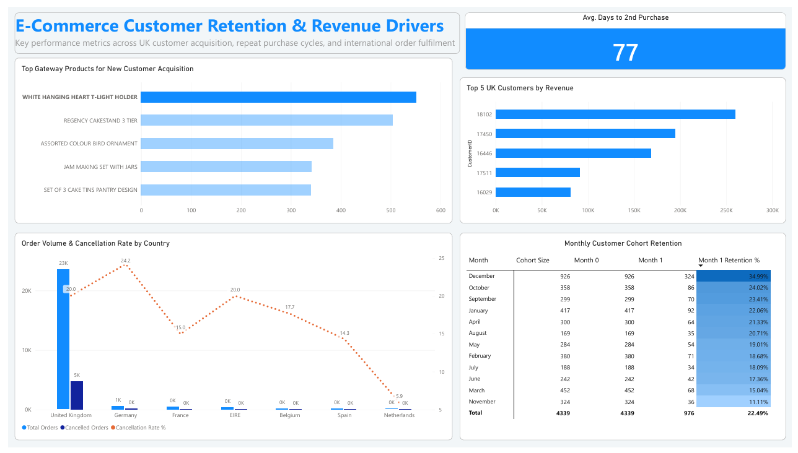

# E-Commerce-Customer-Retention-Revenue-Analytics
Using an E-Commerce Dataset to evaluate insights on E-Commerce Customer Retention &amp; Revenue Performance

---

## Dashboard Preview

---

## Tech Stack

---

## Executive Overview

This end-to-end business intelligence project delivers an executive-level dashboard analyzing customer acquisition quality, repeat purchase cycles, cohort retention dynamics, and global fulfillment performance. Built using **Microsoft SQL Server (SSMS)** for analytical data modeling and **Power BI** for visual exploration, the dashboard transforms raw transactional data into actionable insights for strategic decision-making.

The project addresses key operational and growth questions:
1. **High-Value Accounts:** Who are the top revenue-generating customers in the core UK market?
2. **Purchase Velocity:** How long does it take for a customer to make their second purchase?
3. **Acquisition Drivers:** Which entry products successfully attract first-time buyers?
4. **Cohort Retention:** What percentage of acquired customers return in subsequent months?
5. **Fulfillment Health:** Where are order cancellations occurring globally, and what are the regional churn rates?

---

## Architecture & Technical Stack

- **Database Engine:** Microsoft SQL Server Management Studio (SSMS)
- **Database:** `[Database of kaggle datasets].[dbo].[E-CommerceData]`
- **Transformation Layer:** 5 Custom SQL Analytical Views (`dbo.Question1_TopUKCustomers_vw` through `dbo.Question5_CancellationAnalysis_vw`)
- **Data Visualization:** Power BI Desktop
- **Analytical Measures:** DAX (Data Analysis Expressions) for retention percentages and dynamic aggregations

---

## Key DAX Measures
To display dynamic retention percentages across cohorts, the following DAX measure was engineered in Power BI:

Month 1 Retention % = 
DIVIDE(
    SUM(Question4_CohortRetention_vw[month_1_users]), 
    SUM(Question4_CohortRetention_vw[cohort_size]), 
    0
)

---

## Key Business Insights
Revenue Concentration: Customer 18102 is the top individual account in the UK market, generating over £260K+, significantly outpacing the second-highest customer (£190K+).

Time-to-Second-Purchase: On average, acquiring customers takes 77 days to place their second order, highlighting a vital 60-day window for retention and cross-sell automated workflows.

Hero Acquisition SKUs: Products such as WHITE HANGING HEART T-LIGHT HOLDER and REGENCY CAKESTAND 3 TIER serve as the top conversion drivers for first-time buyers.

Cohort Retention Volatility: Month 1 customer retention averages 22.5% overall, peaking sharply at 35.0% for December holiday cohorts before tapering to off-peak baselines (~11–15%).

International Friction: While the UK represents the vast majority of volume (~23K orders), cancellation rates spike in key European export destinations like Germany (24.2%) and EIRE (20.0%), signaling localized delivery or cross-border payment friction.

---

## Data Source

The raw transactional dataset used in this project is publicly available on Kaggle:
* **Dataset:** [E-Commerce Data on Kaggle](https://www.kaggle.com/datasets/carrie1/ecommerce-data?resource=download)
* **Description:** Contains all transactions occurring between 01/12/2010 and 09/12/2011 for a UK-based non-store online retail company.
